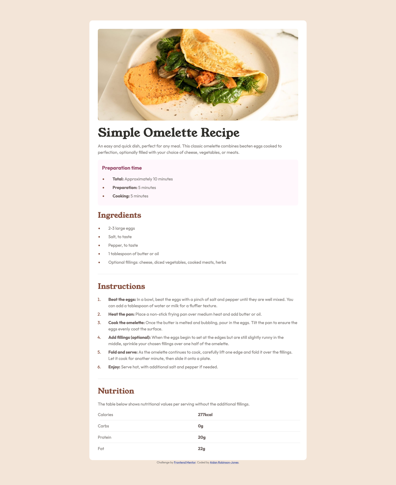
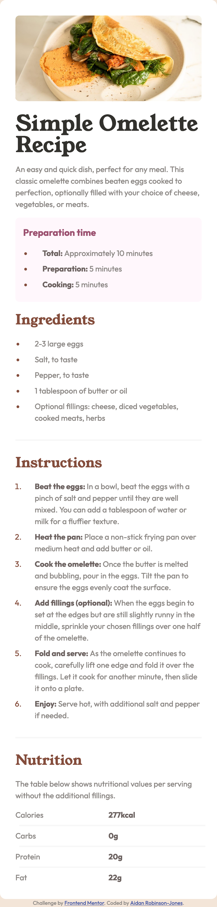

# Frontend Mentor - Recipe page solution

This is a solution to the [Recipe page challenge on Frontend Mentor](https://www.frontendmentor.io/challenges/recipe-page-KiTsR8QQKm). Frontend Mentor challenges help you improve your coding skills by building realistic projects. 

## Table of contents

- [Overview](#overview)
  - [Screenshot](#screenshot)
  - [Links](#links)
- [My process](#my-process)
  - [Built with](#built-with)
- [Author](#author)

## Overview

### Screenshot

### Links

- Solution URL: [https://github.com/AidanRJ1/Frontend-Mentor-Recipe-Page-Main](https://github.com/AidanRJ1/Frontend-Mentor-Recipe-Page-Main)
- Live Site URL: [https://aidanrj1.github.io/Frontend-Mentor-Recipe-Page-Main/](https://aidanrj1.github.io/Frontend-Mentor-Recipe-Page-Main/)

## My process

### Built with

- Semantic HTML5 markup
- CSS Custom Properties
- Responsive Web Design

## Author

- Frontend Mentor - [@AidanRJ1](https://www.frontendmentor.io/profile/AidanRJ1)
